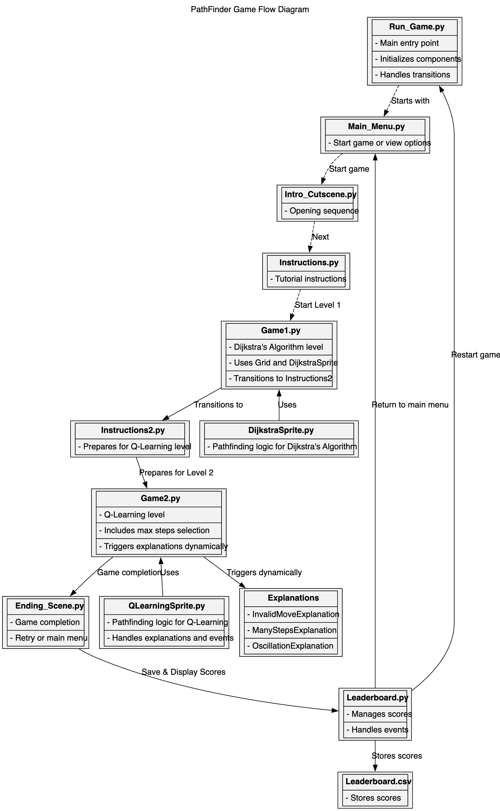

# **Project Overview**

## Table of Contents

1. [Budget and Components](#budget-and-components)
2. [Media](#media)
3. [Electrical and Mechanical Design](#electrical-and-mechanical-design)
4. [Software and Firmware Design](#software-and-firmware-design)
5. [Diagrams](#diagrams)

---

## **Budget and Components**

### Spending Breakdown

Provide a table listing all components, their costs, and sources.

**PLACEHOLDER**: Fill in actual component data in the table below.

| **Component/Material** | **Cost (USD)**        | **Source**          |
| ---------------------- | --------------------- | ------------------- |
| Example Component 1    | $XX                   | Example Source      |
| Example Component 2    | Free (Estimated: $XX) | Donated or Provided |
| Example Component 3    | $XX                   | Purchased/Online    |

**Total Estimated Cost**: **PLACEHOLDER**: Add total value.

---

## **Media**

### Final System in Action

Add images and videos of the final project setup.

**PLACEHOLDER**: Replace this with images and videos of your system in action.

**Example**:
  
_Figure: Completed arcade machine showcasing the game._

### Demo Video

Link to a video demo of the project.

**PLACEHOLDER**: Add demo video link here.

**Example**:  
[Watch the Demo Video](https://your-demo-link.com)

---

## **Electrical and Mechanical Design**

### Electrical Design

Provide a description of the electrical system, including connections, power requirements, and analysis.

**PLACEHOLDER**: Add description of electrical components.

- **Include details on power supply, wiring, and voltage/current analysis.**
- Replace this placeholder with actual circuit diagrams and notes.

**Example**:  
  
_Figure: Circuit schematic showing connections between components._

---

### Mechanical Design

Describe the mechanical structure of the system, materials used, and analysis.

**PLACEHOLDER**: Add mechanical design description.

- Describe materials (e.g., MDF, PLA) and fabrication process.
- Include CAD images or hand-drawn designs as applicable.

**Example**:  
  
_Figure: CAD rendering of the arcade machine._

---

## **Software and Firmware Design**

### Software Design

Provide details on the software architecture, key modules, and external dependencies.

**PLACEHOLDER**: Add software architecture and description.

- Include pathfinding logic (Dijkstra's Algorithm and Q-Learning).
- Describe dependencies such as Pygame, NumPy, or OpenCV.

**Flow Diagram for Game**:  
  
_Figure: Flow diagram representing game architecture and flow._

**Link to Source Code**:  
[PLACEHOLDER: GitHub Repo Link](#)

---

### Firmware Design

Provide details on the firmware (e.g., Arduino logic), including tasks like LED control or input handling.

**PLACEHOLDER**: Add firmware design description.

**Example Snippet**:

```cpp
// Placeholder: LED Button Control Logic
if (buttonPressed) {
    digitalWrite(LED_PIN, HIGH);
} else {
    digitalWrite(LED_PIN, LOW);
}
```

**Link to Source Code**:  
[PLACEHOLDER: Firmware Repo Link](#)

---

## **Diagrams**

### Data and Energy Flow Diagram

Insert a high-level diagram showing how energy and data move through the system.

**PLACEHOLDER**: Add data and energy flow diagram.

**Example**:  
  
_Figure: Data and energy flow in the arcade system._

---

### Subsystem Diagrams

Include additional diagrams that illustrate subsystem connections or component relationships.

**PLACEHOLDER**: Add subsystem diagrams (e.g., mechanical, electrical, or software).

**Example**:  
  
_Figure: Subsystem relationships across hardware, software, and firmware._

---

## **Conclusion**

**PLACEHOLDER**: Add a brief conclusion summarizing the project's success, challenges overcome, and key learnings.
