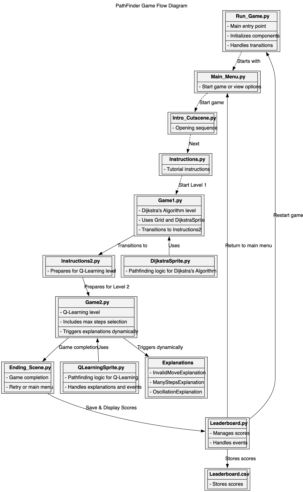

# **Software Design**

### Software Design

The software for **Hatchling's Quest: Pathfinding Trials** is designed to deliver an intuitive, engaging, and educational gaming experience while visualizing pathfinding algorithms in action.

#### **Software Architecture**

### Software Structure and Key Modules

#### Overview:

The software is divided into three main areas:

- **Game Interface**: Handles the GUI, animations, and user input using **Pygame**.
- **Pathfinding Algorithms**:
  - **Dijkstra's Algorithm** (Level 1): Computes shortest paths.
  - **Q-Learning** (Level 2): Enables reward-based navigation.
- **Game Logic**: Manages screens, game states, and leaderboards.

#### Key Modules:

- **`run_game.py`**: Coordinates game flow.
- **`grid/grid.py`**: Defines the pathfinding grid.
- **Pathfinding Modules**:
  - **`sprites/DijkstraSprite.py`**: Implements Dijkstra’s Algorithm.
  - **`sprites/QLearningSprite.py`**: Implements Q-Learning.
- **Screens**: Main menu, instructions, and interactive gameplay feedback.
- **Leaderboard**: Tracks and displays high scores via **`leaderboard/leaderboard.py`**.

#### **Dependencies**

The software relies on the following external libraries:

- **Python 3.11.7**: Core language used for development.
- **NumPy (2.2.0)**: Used for matrix operations in Q-Learning, including Q-table computations.
- **Pygame (2.6.1)**: Provides the framework for rendering the game interface and managing user input.

---

#### **Flow Diagram for Game**

The following flow diagram illustrates the architecture and flow of the game, showing transitions between levels, screens, and algorithms:

  
_Figure: Flow diagram representing game architecture and flow._

---

#### **UML Diagram**

The UML diagram below showcases the architecture and relationships within the game. It highlights key components, such as the flow between screens, sprite classes, and grid interactions, as well as how algorithms like Dijkstra's and Q-Learning are integrated:

  
_Figure: UML diagram representing the game architecture and component relationships._

---

#### **Link to Source Code**

The complete source code for the project is hosted on GitHub:  
[GitHub Repo Link](https://github.com/dakotacsk/pie_shortestpathfindingvisualization)

---
